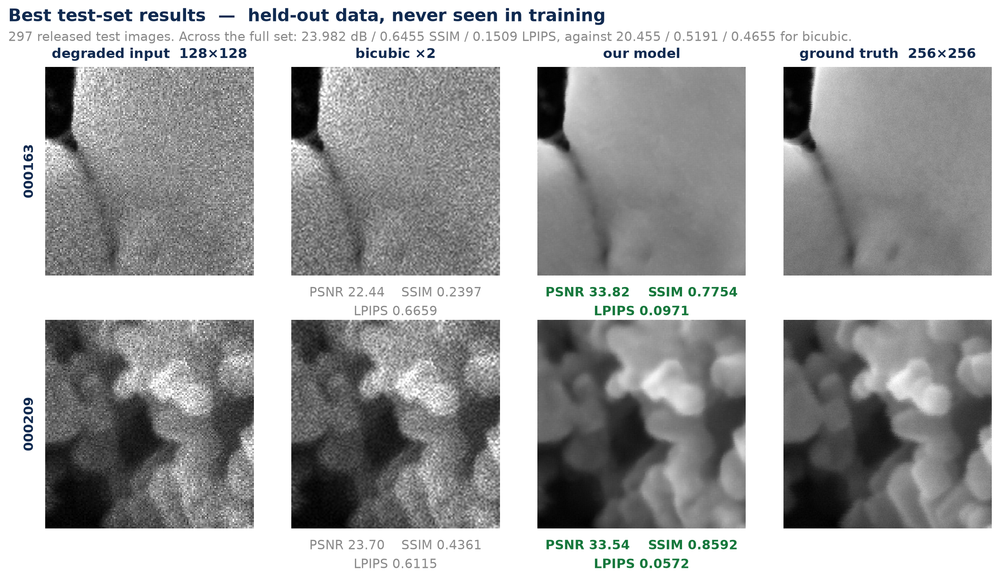

# AI-Based Restoration of Degraded Images for Semiconductor Inspection

KLA problem statement, Hackathon 2026 (SEMICON India), **Phase 2** submission.

Restores degraded SEM arrays to 2× resolution — 128×128 → 256×256 and
256×256 → 512×512 — in a single forward pass of a 6.81 M-parameter
**MiniRestormer**: a channel-attention transformer U-Net that predicts a
*correction* on top of a bicubic upsample rather than the image itself.

**Released test set: 23.982 dB PSNR / 0.6455 SSIM / 0.1509 LPIPS** over all 297
pairs, against 20.455 / 0.5191 / 0.4655 for bicubic. The model was trained and
frozen before those pairs existed.



---

## 1. Run the code

```bash
pip install -r requirements.txt
python run.py <input-dir> <output-dir>
```

That is the whole contract. No source edits, no notebook cells, no local paths,
no configuration, no interaction. The output directory is created if it does not
exist, and the default checkpoint at `models/best.pth` is resolved relative to
`run.py`, so the command works from any working directory.

```bash
python run.py /data/test/NoisyLR ./restored
```

### Input and output contract

| | |
|---|---|
| input | every `*.npy` in `<input-dir>`; shape `(H, W)`, `(H, W, 1)` or `(1, H, W)`. PNG/TIFF also accepted |
| output | one file per input in `<output-dir>`, **same filename, same format** |
| output shape | `(2H, 2W)`, 2-D, grayscale |
| output dtype | `float32` |
| output values | clipped to `[0, 1]`, guaranteed free of NaN and Inf |
| mixed sizes | fine — inputs are grouped by shape, so 128×128 and 256×256 never share a padded batch |
| any size | inputs are reflect-padded to a multiple of 8 and cropped back; attention is over channels, not pixels, so no layer has a fixed spatial size |

On completion `run.py` prints a full end-to-end timing breakdown, so the run
itself is the evidence.

### Optional flags (none is required)

```
--ckpt PATH             alternate checkpoint          default models/best.pth
--batch N               0 = sized from free VRAM      default 0
--fp32                  disable fp16 autocast         default off (fp16 is free)
--device cuda|cpu       default cuda when available
--cudnn-benchmark ...   auto | on | off               default auto
```

---

## 2. Environment

```bash
python -m venv .venv && source .venv/bin/activate
pip install -r requirements.txt
```

Developed on Python 3.12, PyTorch 2.13, CUDA 13.2. **`run.py` imports only
`torch` and `numpy`** — no `torchvision`, no `lpips`, no `skimage`, because those
cost 1–2 s of process startup and are training dependencies only. Nothing is
downloaded at run time, so the pipeline works with no internet access once the
environment is installed.

`pip_freeze.txt` is the complete `pip freeze` of the training environment, as
the submission requirements ask. `requirements.txt` is the minimal installable
subset.

---

## 3. Results

Two sets, kept strictly apart: the **297 released test pairs** (unseen — the
model was already frozen), and **479 held-out val pairs**, 10% of training,
excluded from training *and* from model selection.

| released test set, n=297 | PSNR ↑ | SSIM ↑ | LPIPS ↓ |
|---|---|---|---|
| floor — bicubic ×2 on the noisy input | 20.455 | 0.5191 | 0.4655 |
| **submitted model** | **23.982** | **0.6455** | **0.1509** |
| reference — perfect denoise, then bicubic ×2 | 27.326 | 0.7673 | 0.3246 |

Both reference rows are measured, not assumed. The lower one is what doing
nothing scores. The upper one is what a *flawless* denoiser scores if it is then
unimaginative about resolution — downsample the ground truth, bicubic it back —
and it is **not** an upper bound: it never sees the noisy image, and on LPIPS we
beat it by more than 2×. Between those two rows the model closes **52% of the
achievable PSNR range and 48% of the SSIM range**.

### What we measured and then threw away

Every row below is a full matched training run, judged by paired bootstrap
against the submitted model. All were rejected for the same reason: **each wins
one metric by trading another**, and the organisers never disclosed how the
three are weighted.

| candidate | PSNR | SSIM | LPIPS |
|---|---|---|---|
| synthetic training data from GT | −0.048 | −0.0063 | +0.0092 |
| noise-level conditioning | −0.007 | −0.0007 | +0.0003 |
| degradation augmentation (+ conditioning) | +0.031 | −0.0011 | +0.0048 |
| SSIM matched to the scored implementation | −0.050 | +0.0005 | +0.0002 |
| frequency-domain (FFT) loss | −0.111 | −0.0009 | −0.0005 |
| the 297 test pairs folded into training | −0.025 | −0.0001 | −0.0012 |
| 8× dihedral test-time augmentation | + | + | − (8× the compute) |
| two-model ensemble | +0.36 | + | 2.2× worse |

The submitted model is the only one that is **best on all three at once**. With
the weighting undisclosed, that is the only position we can defend.

The one change that moved all three the same way was the **full-resolution
fine-tuning phase** — the last 8 epochs train on whole images instead of 64px
crops — worth **+0.377 dB / +0.0127 SSIM / −0.0110 LPIPS**. It had been sitting
in `train.py` from the start, gated behind a condition that no time-capped run
ever satisfied. We found it by chasing down a confound that had credited the
gain to something else entirely.

Full tables, the noise floor, the robustness study and every retraction are in
[`results/metrics.md`](results/metrics.md); the long-form write-up is
[`report.pdf`](report.pdf).

---

## 4. Runtime

| | |
|---|---|
| end-to-end, 297 images | **9.1 s** — 24.97 ms/img of inference |
| hardware | NVIDIA RTX 3050 Laptop GPU, 4 GiB, CUDA 13.2 |
| precision | fp16 autocast — identical to fp32 to 4 dp, so it is free |
| timing method | `time.perf_counter()` from `run.py`'s first line to its last file written |

**Startup dominates, and that changed our decisions.** `import torch` plus CUDA
context is ~1.8 s before a single image is touched. On an H100, where inference
for a few hundred images falls to ~0.5–1.4 s, that fixed cost is **56–78% of
end-to-end** — so halving the network would buy ~10% of wall time and cost real
quality. "Shrink the model for speed" is dead here; the right move is to *spend*
inference time on quality. Which is why TTA was measured before a smaller
architecture, and then rejected on its own merits.

Three measured choices follow from this: file reads run on threads started
**before** `import torch`, so disk I/O overlaps CUDA init; there is no
`torch.compile` (30–60 s of compile to save well under 1 s); and
`cudnn.benchmark` is chosen from the input count, not pinned — autotuning finds
11% faster kernels but costs ~26.5 s up front and only repays that at ~9,650
images.

> The first bisect of that last one ran every variant inside one **warm**
> process, where the autotune cache was already populated, and showed no
> difference at all. The effect exists only in a fresh process — which is exactly
> what the graders run.

---

## 5. Reproducing the checkpoint

```bash
cd train
EPOCHS=36 FULLRES_EPOCHS=8 SKIP=learned W_LPIPS=0.10 SYNTH_PROB=0.0 \
MAX_HOURS=3.5 WORKERS=3 SEED=42 \
python train.py <gt-dir> <noisylr-dir> --out-dir runs/s7_fr8
```

146 minutes on an RTX 3050. Data directories are positional arguments (or set
`DATA_DIR` and let it find `GT/` and `NoisyLR/` inside) and every other setting
is an environment-variable override, so no experiment in this project ever
required a source edit, and no path is hardcoded anywhere. Training writes
`best.pth`, `last.pth` and a per-epoch `train_log.csv`, and resumes from
`last.pth` — delete it to start fresh.

| | |
|---|---|
| architecture | `dim=64`, blocks `(2,2,2)`, heads `(1,2,4)`, wide head 32 — 6.81 M parameters |
| input | 64×64 random crops of NoisyLR paired with the exactly-corresponding 128×128 of GT |
| geometric augmentation | dihedral group, 8 exact pixel permutations, applied identically to both halves |
| loss | `0.50·Charbonnier + 0.35·(1−SSIM) + 0.15·gradient + 0.10·LPIPS` |
| optimiser | AdamW, lr 1e-4, weight decay 1e-4, 3-epoch warmup then cosine to 1e-6 |
| precision | fp32 throughout; inference uses fp16 autocast, which is free |
| stabilisers | weight EMA 0.999, gradient clipping 1.0, loss-spike rejection |
| last 8 epochs | full-resolution phase — whole images, not crops |
| split | 90/10, `SPLIT_SEED=42`, held out from training and from selection |
| selection | best held-out SSIM, raw and EMA models both validated |

The architecture is recovered from the checkpoint's **weight shapes** at load
time rather than from saved metadata, so a checkpoint can never silently be
loaded into the wrong model.

---

## 6. Repository layout

```
run.py                    inference entry point: run.py <input-dir> <output-dir>
score.py                  PSNR/SSIM/LPIPS + paired bootstrap — reproduces every table
requirements.txt          minimal installable dependency set
pip_freeze.txt            complete pip freeze of the training environment
README.md                 this file
models/
  __init__.py
  minirestormer.py        the architecture; imports only torch
  best.pth                submitted checkpoint, 6.81 M parameters
train/
  train.py                reproduces the submitted checkpoint
  dataset.py              paired loader, RAM cache, crops, dihedral augmentation
  degrade.py              the fitted forward degradation model
  augment.py              extra degradation on the real input (AUG_PROB)
outputs/                  297 restored test images, one .npy per test input
results/
  metrics.md              full tables, the ablation, robustness, retractions
  test_examples.png       released test pairs: input, bicubic, ours, ground truth
  failure_clean_input.png the clean-input failure case
  headroom.png            how much of the achievable range we close
  robustness_heldout.png  the held-out degradation family
  augmentation_rejected.png
  fullres_phase.png       the full-resolution phase, as a step
  training_curve.png      per-epoch PSNR / SSIM / LPIPS
  dataset_analysis.png    intensity, noise level and content spread
  architecture.png        MiniRestormer
report.pdf                the long-form Phase 2 write-up
Solution_ppt_phase2.pdf   the deck
```

---

## 7. Assumptions, and one honest failure

- **NoisyLR values outside `[0, 1]` are signal, not error.** They carry the
  speckle tail — the training corpus reaches 2.24. The input is passed to the
  model **unmodified**: no normalisation, no centring, no rescaling, no clipping.
  Only the **output** is clipped, inside our own pipeline, because ground truth
  lives in `[0, 1]`. Clamping the input costs 0.094 dB.
- Inputs are single-channel float arrays; outputs preserve the input filename
  and format, and are exactly 2× the input in each spatial dimension.
- The forward degradation was **fitted, not assumed**:
  `y = downsample₂(x)·speckle + shot + read` — Gamma speckle, Poisson shot,
  Gaussian read — with the variance law fitted at R² = 0.99 over 300 real pairs.
  Speckle level varies about **1.8×** across images.
- Nothing synthesises training data. `SYNTH_PROB` ships at 0: three rounds of
  improving the forward-model fit never flipped the sign of that experiment.

**The failure we did not paper over.** Hand the model a *clean* low-resolution
input and it denoises anyway, erasing detail that was never noise — it loses to
plain bicubic on 99% of clean images, by 1.06 dB on average.
`results/failure_clean_input.png` shows it. This is the honest cost of training
on a single noise level, and it is the thing we would fix first.

We tried to fix it with degradation augmentation and reported success. That
result was **circular**: the stress test and the augmenter imported the same
constants from `degrade.py`, so the probe drew from exactly the distribution the
model had trained on. Re-run against a held-out family — uniform noise, box
blur, quantisation, none of which any augmenter can produce — the finding
inverted:

> Training on variety of **kind** transfers to unseen degradations.
> Training on variety of **amount** does not.

Augmenting with *more of our own fitted noise* buys nothing at all (+0.4184
LPIPS degradation against the baseline's +0.4214). Augmenting with a *different
kind* of degradation degrades **3.4× less** (+0.1241). That model is not the one
submitted — it costs 0.0072 LPIPS in-distribution, and how far the test set's
OOD half actually sits is the one thing we could not measure — but the rule it
earned is general: **an augmentation and the probe used to validate it must
never share a generator.**

---

## 8. External resources

| resource | how it is used | licence |
|---|---|---|
| [Restormer](https://arxiv.org/abs/2111.09881) (Zamir et al., CVPR 2022) | MDTA / GDFN transformer block design | MIT-style, paper |
| [NAFNet](https://arxiv.org/abs/2204.04676) (Chen et al., ECCV 2022) | TinyNAFNet baseline, Phase 1 | paper |
| [`lpips`](https://github.com/richzhang/PerceptualSimilarity) (Zhang et al., CVPR 2018), AlexNet backbone | training loss and reported metric. **Not part of the inference pipeline** and not needed to run `run.py` | BSD-2-Clause |
| [PyTorch](https://github.com/pytorch/pytorch) | framework | BSD-3-Clause |
| [NumPy](https://github.com/numpy/numpy) | array I/O | BSD-3-Clause |
| [scikit-image](https://github.com/scikit-image/scikit-image) | SSIM during evaluation | BSD-3-Clause |
| [SciPy](https://github.com/scipy/scipy) | degradation-model fitting | BSD-3-Clause |

The dataset is derived from the [NFFA-EUROPE 100% SEM
Dataset](https://doi.org/10.23728/b2share.80df8606fcdb4b2bae1656f0dc6db8ba)
(Aversa, Modarres, Cozzini & Ciancio, 2018; CC-BY 4.0), as provided by the
organisers.

**No external datasets and no pretrained restoration weights were used.** Every
trainable parameter is initialised and optimised from scratch on the provided
pairs. The architecture is written in plain PyTorch modules — nothing pretrained
is imported — and the inference path is entirely self-contained.
